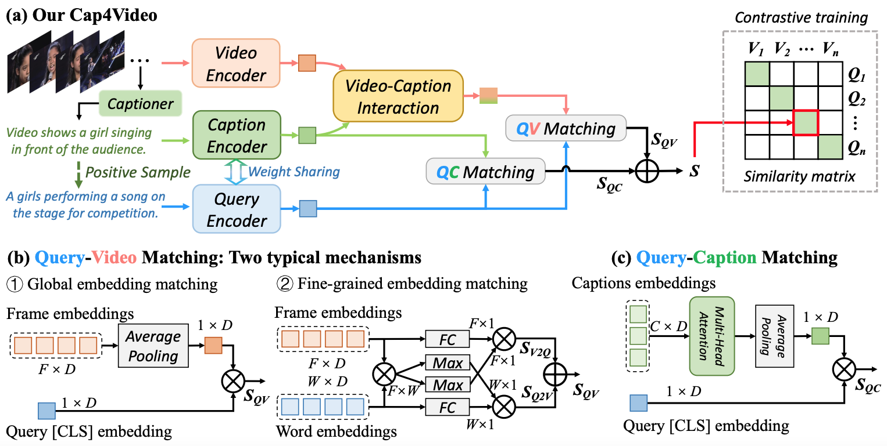
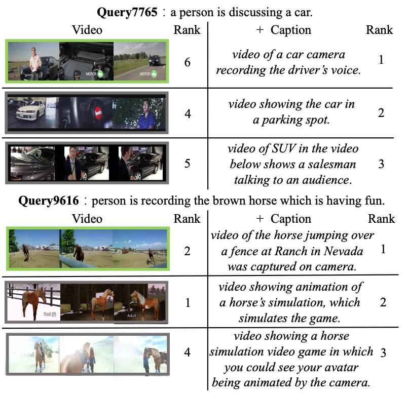

<div align="center">

<h2>【CVPR'2023 🌟Highlight🌟 & TPAMI】Cap4Video: What Can Auxiliary Captions Do for Text-Video Retrieval? </h2>


[-f9f107.svg)](https://openaccess.thecvf.com/content/CVPR2023/html/Wu_Cap4Video_What_Can_Auxiliary_Captions_Do_for_Text-Video_Retrieval_CVPR_2023_paper.html)
[](https://arxiv.org/abs/2301.00184)

[Wenhao Wu](https://whwu95.github.io/)<sup>1,2</sup>, [Haipeng Luo]()<sup>3</sup>, [Bo Fang](https://bofang98.github.io/)<sup>3</sup>,  [Jingdong Wang](https://jingdongwang2017.github.io/)<sup>2</sup>, [Wanli Ouyang](https://wlouyang.github.io/)<sup>4,1</sup>

 
<sup>1</sup>[The University of Sydney](https://www.sydney.edu.au/), <sup>2</sup>[Baidu](https://vis.baidu.com/#/), <sup>3</sup>[UCAS](https://english.ucas.ac.cn/), <sup>4</sup>[Shanghai AI Lab](https://www.shlab.org.cn/)


</div>

***

[](https://paperswithcode.com/sota/video-retrieval-on-vatex?p=cap4video-what-can-auxiliary-captions-do-for)
[](https://paperswithcode.com/sota/video-retrieval-on-msvd?p=cap4video-what-can-auxiliary-captions-do-for)
[](https://paperswithcode.com/sota/video-retrieval-on-msr-vtt-1ka?p=cap4video-what-can-auxiliary-captions-do-for)
[](https://paperswithcode.com/sota/video-retrieval-on-didemo?p=cap4video-what-can-auxiliary-captions-do-for)

Welcome to the official implementation of **Cap4Video** - an innovative framework that maximizes the utility of auxiliary captions generated by powerful LLMs (e.g., GPT) to enhance video-text matching. 


<details open><summary>📣 I also have other cross-modal video projects that may interest you ✨. </summary><p>


> [**Revisiting Classifier: Transferring Vision-Language Models for Video Recognition**](https://arxiv.org/abs/2207.01297)<br>
> Wenhao Wu, Zhun Sun, Wanli Ouyang <br>
> [](https://ojs.aaai.org/index.php/AAAI/article/view/25386/25158) [](https://link.springer.com/article/10.1007/s11263-023-01876-w) [](https://github.com/whwu95/Text4Vis) 


> [**Bidirectional Cross-Modal Knowledge Exploration for Video Recognition with Pre-trained Vision-Language Models**](https://arxiv.org/abs/2301.00182)<br>
> Wenhao Wu, Xiaohan Wang, Haipeng Luo, Jingdong Wang, Yi Yang, Wanli Ouyang <br>
> [](https://openaccess.thecvf.com/content/CVPR2023/html/Wu_Bidirectional_Cross-Modal_Knowledge_Exploration_for_Video_Recognition_With_Pre-Trained_Vision-Language_CVPR_2023_paper.html) [](https://github.com/whwu95/BIKE) 


</p></details>


<!-- I am currently traveling and may not be able to open-source the code until May. -->


## News
- [x] **[May 24, 2024]** The [extension](https://ieeexplore.ieee.org/abstract/document/10670217) of Cap4Video has been accepted by TPAMI 🎉🎉!!
- [x] **[Apr 27, 2023]** Our code has been released. Thanks for your star 😝.
- [x] **[Mar 21, 2023]** 😍 Our **Cap4Video** has been selected as a 🌟**Highlight**🌟 paper at CVPR 2023! (Top 2.5% of 9155 submissions).
- [x] **[Feb 28, 2023]** 🎉 Our **Cap4Video** has been accepted by **CVPR-2023**.


## Overview
Cap4Video leverages captions generated by large language models to improve text-video matching in three ways: (1) input data augmentation during training, (2) intermediate video-caption feature interaction for creating compact video representations, and (3) output score fusion for enhancing text-video matching. Cap4Video is compatible with both global and fine-grained matching.




<!-- ## Content
- [Prerequisites](#prerequisites)
- [Data Preparation](#data-preparation)
- [Training](#training)
- [BibTeX & Citation](#bibtex)
- [Acknowledgment](#acknowledgment) -->


## Requirement
```sh
# From CLIP
conda install --yes -c pytorch pytorch=1.8.1 torchvision cudatoolkit=11.1
pip install ftfy regex tqdm
pip install opencv-python boto3 requests pandas
```

## Data Preparing
All video datasets can be downloaded from respective official links. In order to improve training efficiency, we have preprocessed these videos into frames, which we have packaged and uploaded for convenient reproduction of our results.

| Dataset | Official Link| Ours|
|:------------:|:-------------------:|:------------------:|
| MSRVTT | [Video](http://ms-multimedia-challenge.com/2017/dataset)| [Frames](https://unisyd-my.sharepoint.com/:u:/g/personal/wenhao_wu_sydney_edu_au/EQEYklCTUClGu01komekxcgBQ5lxeInfRm-fhlikMyb8hA?e=UaC93C) | 
| DiDeMo | [Video](https://github.com/LisaAnne/LocalizingMoments)| [Video](https://unisyd-my.sharepoint.com/:u:/g/personal/wenhao_wu_sydney_edu_au/Ef2z3r1kdjVNt2Muu2KHzWoB5H0gwVPybd1OiffqIfU8jA?e=d8RUJv) | 
| MSVD | [Video](https://www.cs.utexas.edu/users/ml/clamp/videoDescription/)| [Frames](https://unisyd-my.sharepoint.com/:u:/g/personal/wenhao_wu_sydney_edu_au/EUdl9tM7TRlFsWqLC4V3ffUBAvqIrcUBXHbLEE4p3SiQVQ?e=jeijlW)| 
| VATEX | [Video](https://eric-xw.github.io/vatex-website/download.html)| [Frames](https://unisyd-my.sharepoint.com/:u:/g/personal/wenhao_wu_sydney_edu_au/EQd5BwA_bcFBn7SRl0D69XABO4xveLZtu6PUK_DQKEyxfg?e=D3QmOk) | 

## How to Run
- To begin, you will need to prepare a video dataset that has been processed into frames.
- Next, download the [CLIP B/32](https://openaipublic.azureedge.net/clip/models/40d365715913c9da98579312b702a82c18be219cc2a73407c4526f58eba950af/ViT-B-32.pt) and [CLIP B/16](https://openaipublic.azureedge.net/clip/models/5806e77cd80f8b59890b7e101eabd078d9fb84e6937f9e85e4ecb61988df416f/ViT-B-16.pt) models and place them in the `modules` folder. 
- Then, download the [Caption files](https://github.com/whwu95/Cap4Video/releases) that we provide, and place them in the `data` folder.
- Finally, execute the following command to train MSRVTT dataset.

  ```sh
  # For more details, please refer to the co_train_msrvtt.sh  
  # DATA_PATH=[Your MSRVTT data path]
  sh co_train_msrvtt.sh
  ```


## Visualization

The text-video results on the MSR-VTT 1K-A test set.
**Left**: The ranking results of the query-video matching model.
**Right**: The ranking results of Cap4Video, which incorporates generated captions to enhance retrieval.

<div align="center">




</div>

<a name="bibtex"></a>
## 📌 BibTeX & Citation

If you use our code in your research or wish to refer to the results, please star 🌟 this repo and use the following BibTeX 📑 entry.

```bibtex
@inproceedings{cap4video,
  title={Cap4Video: What Can Auxiliary Captions Do for Text-Video Retrieval?},
  author={Wu, Wenhao and Luo, Haipeng and Fang, Bo and Wang, Jingdong and Ouyang, Wanli},
  booktitle={Proceedings of the IEEE/CVF Conference on Computer Vision and Pattern Recognition (CVPR)},
  year={2023}
}


@article{wu2024cap4video++,
  title={Cap4Video++: Enhancing Video Understanding with Auxiliary Captions},
  author={Wu, Wenhao and Wang, Xiaohan and Luo, Haipeng and Wang, Jingdong and Yang, Yi and Ouyang, Wanli},
  journal={IEEE Transactions on Pattern Analysis and Machine Intelligence},
  year={2024},
  publisher={IEEE}
}
```

<a name="acknowledgment"></a>
## 🎗️ Acknowledgement
This repository is built in part on the excellent works of [CLIP4Clip](https://github.com/ArrowLuo/CLIP4Clip) and [DRL](https://github.com/foolwood/DRL). We use [Video ZeroCap](https://github.com/YoadTew/zero-shot-video-to-text) to pre-extract captions from the videos.
We extend our sincere gratitude to these contributors for their invaluable contributions.


## 👫 Contact
For any questions, please feel free to file an issue.

